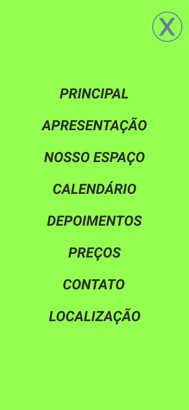
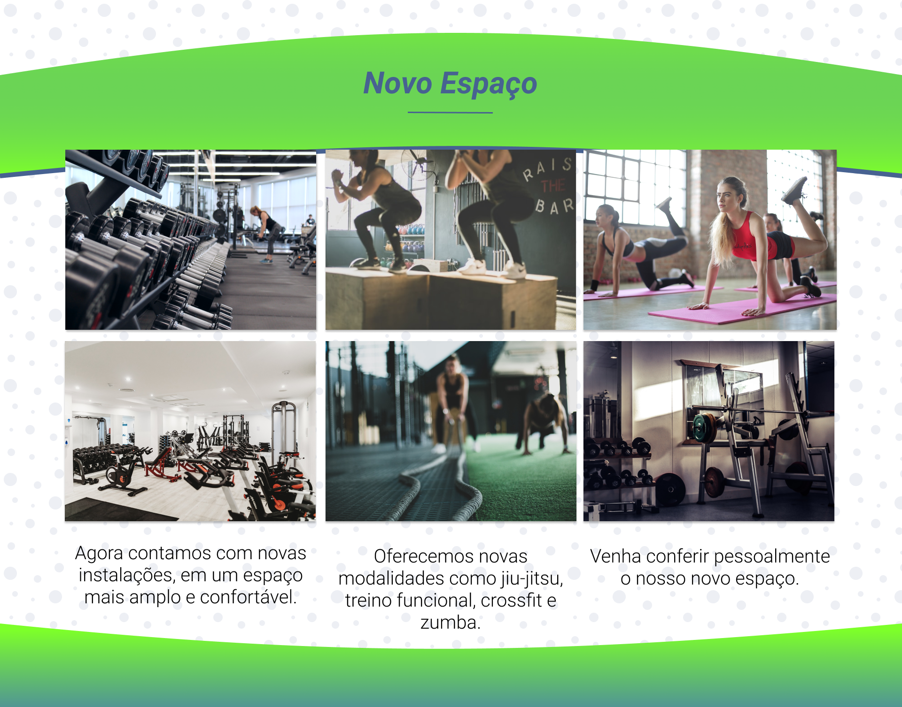
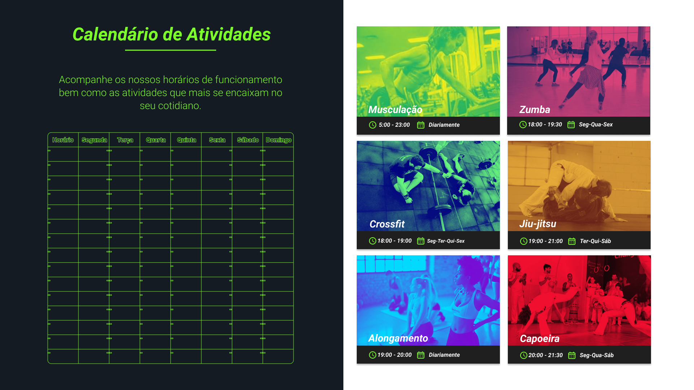
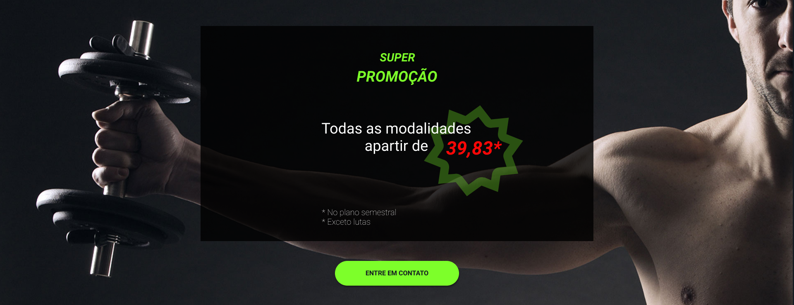
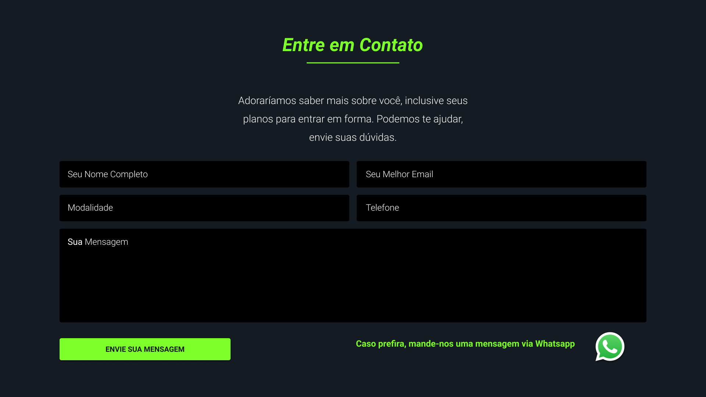
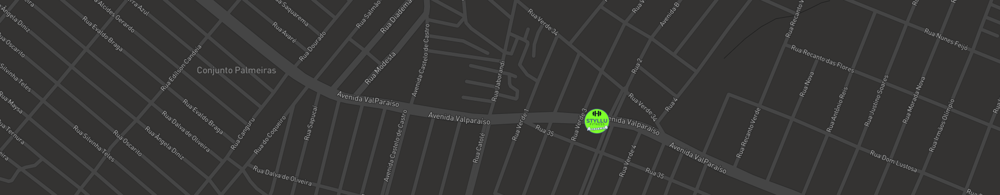

# 2019 -  STYLLU FITNESS - ACADEMIA
## A Mobile First Website for a Brazilian Gym Using the Latest Front-end Technologies.

### This project was designed using Figma and Gimp

### Design

- Figma
- Gimp

### Front-end

- HTML
- React
- EcmaScript6
- CSS / SASS
- jQuery
- Bootstrap

---

### Live Demo

#### MOBILE
#### https://bit.ly/37BirTw

#### DESKTOP
#### https://bit.ly/34hTXwK

---

### Screenshots

#### Mobile

#### Desktop

