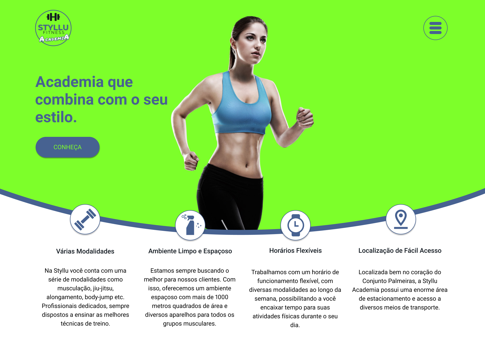

# 2019 -  STYLLU FITNESS - ACADEMIA
## A Mobile First Website for a Brazilian Gym Using the Latest Front-end Technologies.

### This project was designed using Figma and Gimp

### Design

- Figma
- Gimp

### Front-end

- HTML
- React
- EcmaScript6
- CSS / SASS
- jQuery
- Bootstrap

---

### Live Demo

#### MOBILE
#### https://bit.ly/37BirTw

#### DESKTOP
#### https://bit.ly/34hTXwK

<iframe style="border: none;" width="800" height="450" src="https://www.figma.com/embed?embed_host=share&url=https%3A%2F%2Fwww.figma.com%2Fproto%2F6aAxsWtn9Ay2kSmjHNPime%2FStyllu-Fitness%3Fnode-id%3D14%253A1%26viewport%3D204%252C17%252C0.06334978342056274%26scaling%3Dscale-down" allowfullscreen></iframe>

---

### Screenshots

#### Mobile

#### Desktop

